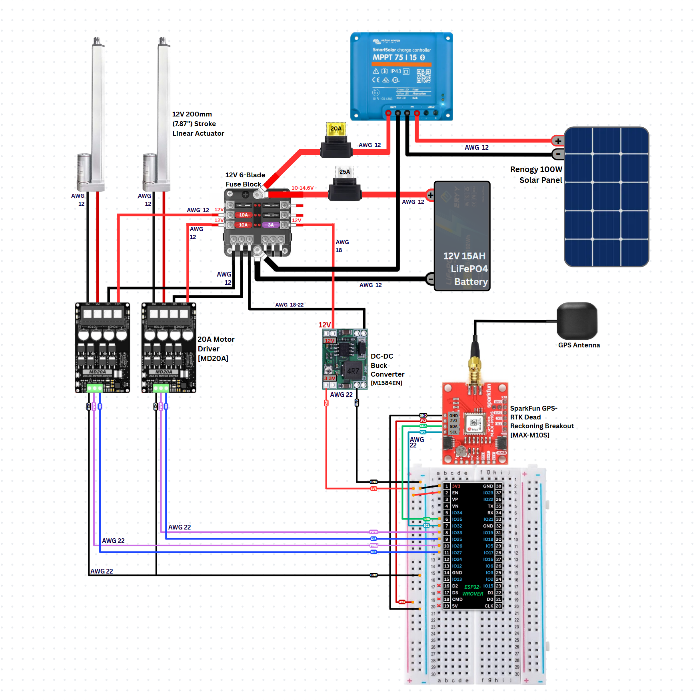

# Soltrac – ESP32 GPS Solar Tracker (Capstone Project)

Autonomous dual‑axis solar panel tracker using an ESP32. Computes real‑time sun position from GPS + astronomical algorithms and drives motors to maximize irradiance while monitoring battery health and conserving power.

## Key Features
- Dual‑axis tracking (azimuth + elevation)
- GPS-based location & time source
- Solar position calculation (declination, hour angle, altitude, azimuth)
- Battery voltage sensing with filtering & thresholds
- Motor control abstraction
- Start button workflow & LED status patterns
- Modular ESP-IDF component architecture
- Power-awareness (low-voltage handling, future sleep mode)

## LED Status Patterns
| State | Pattern | Meaning |
|-------|---------|---------|
| STARTUP | Fast blink (250 ms) | Initializing subsystems |
| WAITING | Solid ON | Awaiting user start |
| TRACKING | Slow blink (2 s) | Active sun tracking |
| ERROR | Rapid blink (100 ms) | Fault condition |
| SLEEP | OFF | Low-power state |

## Repository Structure
```
Soltrac/
├─ main/              # app_main entry
├─ include/           # shared headers
├─ components/
│  ├─ battery/        # ADC voltage sampling & filtering
│  ├─ button/         # Start button handling
│  ├─ gps/            # GPS parsing & interface
│  ├─ motor/          # Motor control layer
│  ├─ solar/          # Solar position math
│  └─ tracking/       # High-level tracking logic
└─ README.md
```

## High-Level Flow
```
[GPS] → coords/time ─┐
                     ├→ [Solar Calc] → target angles → [Tracking] → [Motor Control]
[Battery ADC] → V ---┘                            │
                             LED / safety logic ←┘
```

## Build & Flash (ESP-IDF)
```
idf.py set-target esp32
idf.py build
idf.py flash monitor
```

## Typical Use
1. Power device (LED fast blink).
2. Wait for solid LED (ready).
3. Press start button → tracking begins.
4. Observe slow blink during operation.
5. Low battery triggers warnings (log + potential future safe mode).

## Battery Monitoring
- ADC averaging + low-pass filter (alpha = 0.1)
- Divider ratio: 4:1 (adjust in battery.c if hardware changes)
- Thresholds configurable in config.h


## Development Notes
- Keep compute-heavy operations out of ISR context.
- Monitor log levels (reduce I-tag spam for production).
- Calibrate ADC with ESP-IDF calibration APIs if precision required.


## Acknowledgments
ESP-IDF framework, open solar position references.

## Wiring Diagram



---
Concise, modular, hardware-aware design suitable for senior design evaluation.
