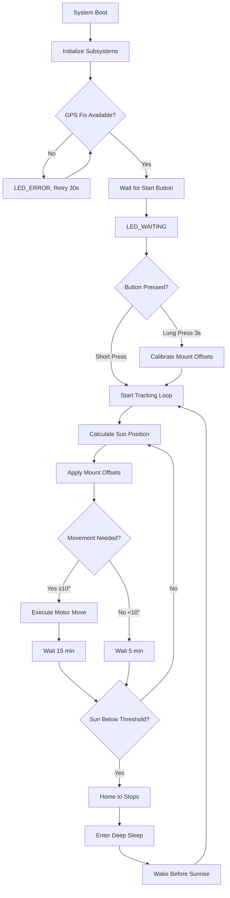

# Sunflower – ESP32 GPS Solar Tracker (Capstone Project)

Autonomous dual‑axis solar panel tracker using an ESP32. Computes real‑time sun position from GPS + astronomical algorithms and drives motors to maximize irradiance while monitoring battery health and conserving power.

## System Overview

**Hardware Platform**: ESP32-CAM + MAX-M10S GPS + MD20A motor drivers + 200mm linear actuators  
**Control Algorithm**: Time-of-motion positioning with nightly mechanical homing  
**Power Management**: Deep sleep cycles with sunrise/sunset scheduling  
**Data Logging**: MicroSD card with CSV telemetry + human-readable event logs  
**Deployment**: Install-once calibration eliminates need for precise base alignment  

## Key Features

### Core Tracking System
- **Dual-axis tracking**: Azimuth (0-270°) + Elevation (10-85°) with 10° tolerance
- **Sensorless positioning**: Time-based actuator control with daily homing cycles
- **GPS-based navigation**: Real-time position and UTC time from satellite constellation
- **NOAA solar algorithms**: Sub-degree accuracy sun position calculation
- **Install-time calibration**: One-button offset learning for any base orientation

### Power & Reliability
- **Deep sleep scheduling**: Automatic night shutdown with pre-sunrise wake
- **Battery monitoring**: Voltage sensing with low-power alerts (planned)
- **Mechanical homing**: Nightly drive-to-stops eliminates accumulated position error
- **Weather resilience**: Outdoor-rated components with sealed enclosures
- **Data persistence**: NVS flash storage preserves state across power cycles

### User Interface & Monitoring
- **Status LED patterns**: Visual feedback for remote system health monitoring
- **One-button operation**: Start tracking + calibration via single button interface
- **SD card logging**: CSV data for analysis + timestamped event logs
- **Serial diagnostics**: Detailed debug output for troubleshooting

## Hardware Configuration

### Pin Assignments (ESP32-CAM Compatible)
```
GPS (I2C):          SDA=18, SCL=19, Addr=0x42
Motors (PWM+DIR):   AZ_PWM=32, AZ_DIR=33, EL_PWM=26, EL_DIR=27  
SD Card (SPI):      MOSI=15, MISO=2, SCK=14, CS=13
User Interface:     LED=4, Button=25
Power:              12V battery + solar panel charging
```

## Wiring Diagram


*Complete wiring schematic showing ESP32-CAM connections to GPS, motor drivers, 
SD card, and user interface components. Verify all pin assignments match the 
definitions in main.c before assembly.*

### Component Specifications
- **ESP32-CAM**: Main controller with built-in WiFi/Bluetooth (unused)
- **MAX-M10S GPS**: u-blox GPS with I2C interface, ~3m accuracy
- **MD20A Motor Drivers**: 12V PWM motor controllers, 30A peak current
- **200mm Linear Actuators**: 12V, 11.94mm/s nominal speed, 1000N force
- **MicroSD Card**: Industrial grade recommended for data logging
- **12V Battery**: Lead-acid or LiFePO4, 20-100Ah depending on solar panel size

## LED Status Patterns
| State | Pattern | Meaning | Duration |
|-------|---------|---------|----------|
| **STARTUP** | Fast blink (250ms) | System initializing | 30-60s |
| **WAITING** | Solid ON | Awaiting GPS fix or user start | Variable |
| **TRACKING** | Slow pulse (200ms on, 1800ms off) | Normal sun tracking | Continuous |
| **ERROR** | Rapid blink (100ms) | GPS loss or system fault | Until resolved |
| **SLEEP** | OFF | Deep sleep mode | 8-12 hours |

## Repository Structure
```
Soltrac/
├── main/
│   └── main.c              # Application entry point & initialization
├── components/
│   ├── battery/            # ADC voltage monitoring & low-power detection
│   ├── button/             # Debounced button input with long-press detection  
│   ├── gps/                # MAX-M10S I2C interface & u-blox protocol parsing
│   ├── motor/              # PWM motor control with time-based positioning
│   ├── sdlog/              # MicroSD logging system (CSV + text logs)
│   ├── solar/              # NOAA solar position algorithms & sunrise/sunset
│   ├── status_led/         # LED pattern generator with FreeRTOS task
│   └── tracking/           # Main tracking controller & deep sleep management
├── include/
│   └── config.h            # System-wide configuration constants
├── WiringDiagram.png       # Hardware connection diagram
└── README.md
```

## Control Algorithm Flow



## Installation & Calibration

### Initial Setup
1. **Hardware Assembly**: Mount actuators, connect wiring per diagram
2. **Firmware Flash**: `idf.py flash monitor` 
3. **SD Card**: Insert formatted microSD card for logging
4. **Power On**: 12V battery connection, observe LED_STARTUP pattern

### Calibration Procedure  
1. **GPS Acquisition**: Wait for LED_WAITING (solid on) indicating GPS fix
2. **Manual Alignment**: Physically align panel to point directly at sun
3. **Calibration**: Long-press start button (3+ seconds) to store mount offsets
4. **Start Tracking**: Short-press start button to begin autonomous operation

### Verification
- LED changes to LED_TRACKING (slow pulse) indicating normal operation
- Check SD card logs for movement commands and GPS coordinates
- Monitor serial output for detailed system diagnostics

## Build & Flash (ESP-IDF)

### Prerequisites
```bash
# Install ESP-IDF (v5.0+ recommended)
git clone --recursive https://github.com/espressif/esp-idf.git
cd esp-idf && ./install.sh && source export.sh

# Hardware requirements
# - ESP32-CAM development board
# - USB-to-serial adapter (CP2102 or similar)
# - 12V power supply for testing
```

### Compilation
```bash
cd Soltrac
idf.py set-target esp32
idf.py menuconfig          # Optional: adjust logging levels, NVS partition size
idf.py build
idf.py -p /dev/ttyUSB0 flash monitor
```

### Configuration Options
- **Logging Level**: Set to INFO for production, DEBUG for troubleshooting
- **NVS Partition**: Default 24KB sufficient for state storage
- **Task Stack Sizes**: Increase if adding features requiring more RAM

## Operation & Monitoring

### Normal Operation Cycle
```
06:00 - Wake from deep sleep (10 min before sunrise)
06:10 - Sunrise tracking begins, LED_TRACKING pattern
12:00 - Solar noon, maximum tracking frequency (15 min intervals)
18:00 - Sunset approach, final tracking moves
19:00 - Home to mechanical stops, enter deep sleep
19:30 - Deep sleep until next sunrise (-10 min)
```

### Data Analysis
**CSV Log Format** (`/sdcard/soltrac.csv`):
```csv
unix_ts,lat,lon,fix,sats,az_target,el_target,az_cur,el_cur,moves_today,total_moves,batt_v,notes
1699123456,40.123456,-74.123456,3,8,180.5,45.2,180.0,45.0,12,1234,12.6,TRACK_15
```

**Human-Readable Logs** (`/sdcard/soltrac.log`):
```
[2023-11-04 14:30:15] Movement required: az=180.0° → 185.5° el=45.0° → 42.3°
[2023-11-04 14:30:18] Move #1235: az=185.5° el=42.3° (today: 13)
[2023-11-04 14:45:20] Within tolerance. No move needed.
```

### Troubleshooting Guide

| Symptom | Likely Cause | Solution |
|---------|--------------|----------|
| LED_ERROR continuous | No GPS fix | Check antenna, clear sky view |
| No movement after start | Calibration needed | Long-press button when aligned to sun |
| Erratic movements | Mount offsets wrong | Re-calibrate during sunny conditions |
| Early sleep entry | GPS time incorrect | Wait for fresh GPS fix |
| SD card errors | Card compatibility | Use Class 10+ industrial grade card |

## Power Consumption Analysis

### Current Draw by Mode
- **Deep Sleep**: 10-50 µA (RTC timer only)
- **Active Tracking**: 150-300 mA (GPS + CPU + peripherals)  
- **Motor Moves**: 500-1000 mA (brief, 5-10 second duration)
- **Daily Average**: 20-40 mA (depends on tracking frequency and weather)

### Battery Sizing Example
**Target**: 3 days autonomy without solar charging  
**Load**: 40 mA average × 24 hours × 3 days = 2.88 Ah  
**Battery**: 20 Ah (accounting for depth-of-discharge limits)  
**Solar Panel**: 50W minimum for daily energy balance + margin  

## Advanced Features

### Automatic Homing System
- **Trigger**: Every night before sleep entry
- **Sequence**: Drive AZ to retract stop, EL to extend stop  
- **Duration**: 22 seconds per axis (200mm stroke ÷ 11.94mm/s + margin)
- **Benefit**: Eliminates accumulated position error from open-loop control

### Dynamic Cadence Control
- **Fast Mode**: 5-minute checks when waiting for sun movement threshold
- **Slow Mode**: 15-minute checks after successful tracking moves
- **Threshold**: 10° angular change triggers movement and mode switch
- **Power Savings**: Reduces CPU wake frequency during stable conditions

### Install-Time Calibration
- **Process**: Manually align panel to sun, long-press calibration button
- **Calculation**: `mount_offset = sun_earth_position - current_mount_angles`
- **Storage**: Offsets saved in NVS flash, survive power cycles
- **Benefit**: Base can be installed in any orientation, tracking accuracy maintained

## Development Notes

### Code Architecture
- **Component-based design**: Each subsystem in separate ESP-IDF component
- **Task priorities**: Critical (GPS/motors) > Tracking > UI > LED patterns
- **Error handling**: Graceful degradation, preserve core tracking functionality
- **Memory management**: Static allocation preferred, minimal dynamic allocation

### Debug Configuration  
```c
// menuconfig → Component config → Log output
#define LOG_LOCAL_LEVEL ESP_LOG_DEBUG   // Enable debug logs
#define CONFIG_LOG_DEFAULT_LEVEL 4      // INFO level for production

// Serial monitor commands
idf.py monitor -p /dev/ttyUSB0 -b 115200
# Ctrl+] to exit, Ctrl+T Ctrl+H for help
```

### Performance Tuning
- **GPS polling**: Every 30s during tracking, reduces I2C traffic
- **Solar calculations**: Cached for 1-minute intervals, sufficient accuracy
- **NVS writes**: Only on significant state changes, preserves flash endurance
- **Task delays**: Precise timing via `vTaskDelayUntil()` for consistent cadence

## Safety & Compliance

### Electrical Safety
- **Overcurrent protection**: 30A fuses on motor power circuits
- **Reverse polarity protection**: Schottky diodes on power inputs  
- **ESD protection**: TVS diodes on exposed signal lines
- **Enclosure rating**: IP65 minimum for outdoor installation

### Mechanical Safety  
- **Limit switches**: Hardware stops prevent actuator overextension
- **Wind stow**: High wind speed detection and panel protection (planned)
- **Manual override**: Emergency stops and manual positioning capability
- **Maintenance access**: Safe procedures for cleaning and inspection

## Acknowledgments

- **ESP-IDF Framework**: Espressif's comprehensive IoT development platform
- **u-blox GPS**: Reliable satellite navigation with civilian precision  
- **NOAA Solar Algorithms**: Accurate astronomical calculations for tracking
- **Open Source Community**: Libraries, examples, and troubleshooting resources

## License

This project is developed for academic purposes as part of an Electrical/Computer Engineering capstone project. Hardware designs and software implementations are provided for educational reference.

## Support & Contact

For technical questions, hardware compatibility issues, or deployment assistance:
- **Documentation**: See component README files for subsystem details
- **Debug Logs**: Enable ESP_LOG_DEBUG level for detailed troubleshooting  
- **Hardware Issues**: Check wiring diagram and component specifications
- **Performance Analysis**: Use CSV logs for tracking accuracy evaluation

---

**Designed for reliability, optimized for efficiency, built for the real world.**
